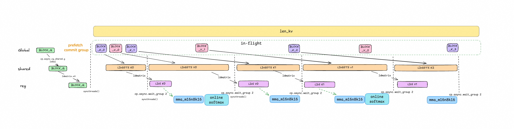

# FlashAttention for NVIDIA Blackwell (RTX 5090)

本项目包含两套独立的 FlashAttention 实现，针对 NVIDIA Blackwell 架构（SM120）优化，在 RTX 5090 上达到高性能。

---

## 目录结构

```
fa/
├── blackwell/                  # [Set 1] CUTLASS 优化版本
│   ├── setup.py                #   编译安装脚本
│   └── sm120attn/              #   Python 模块
│       ├── api.py              #   调用接口
│       └── src/                #   CUDA kernel 源码
│           ├── api.cu
│           ├── kernel_ws.h     #   Warp-specialized kernel
│           ├── mainloop_tma_ws.h
│           ├── epilogue_tma_ws.h
│           ├── block_info.h
│           ├── kernel_traits.h
│           ├── launch.h
│           ├── named_barrier.h
│           ├── params.h
│           ├── softmax.h
│           ├── static_switch.h
│           ├── tile_scheduler.h
│           └── utils.h
│
├── src/                        # [Set 2] 纯 PTX 手写版本
│   ├── attention.cu            #   CUDA PTX kernel
│   ├── attention.cpp           #   PyTorch binding
│   └── main.py                 #   基准测试示例（用法见下）
│
├── include/                    # Set 2 共用头文件
│   └── common.h                #   cp.async, ldmatrix, mma 工具
│
├── examples/                   # 跨实现基准测试
│   ├── sm120_fa.py             #   对比 FA2/FA3/FA4/cuDNN/SDPA
│   ├── test_accuracy.py        #   精度测试
│   └── plot_chat.py            #   性能可视化
│
└── images/                     # 架构图与性能图
    ├── pipeline.png
    ├── warp-spec.png
    └── warp-spec2.png
```

---

## 两套实现详解

### Set 1: `blackwell/` — CUTLASS 优化版本

基于 NVIDIA CUTLASS 框架，使用 CUDA 12.8+ 新特性为 SM120 深度优化。

| 特性 | 说明 |
|------|------|
| **Persistent Kernel** | 线程块持续处理多个 tile，减少调度开销 |
| **Warp Specialization** | Producer-consumer ping-pong 模式 |
| **TMA (Tensor Memory Accelerator)** | 异步全局→共享内存数据搬运 |
| **Double Buffering** | 计算与数据加载流水线重叠 |
| **精度** | bf16 |

#### 安装

```bash
# 依赖: python>=3.13, torch>=2.8.0, CUDA>=12.8
cd blackwell
pip install -e . --no-build-isolation
```

安装后通过 `from sm120attn import fa_5090` 调用。

---

### Set 2: `src/` + `include/` — 纯 PTX 手写版本

不依赖 CUTLASS，直接用 PTX 汇编指令手写 FlashAttention v2 算法。

| 特性 | 说明 |
|------|------|
| **ldmatrix.x4** | 从共享内存加载 8×8 bf16 tile |
| **mma.m16n8k16** | 16×8×16 bf16 矩阵乘累加 |
| **cp.async.cg.shared.global** | 异步全局→共享内存拷贝 |
| **head_dim=128** | 完整支持 128 维注意力头 |
| **算法** | FlashAttention v2 |

#### 使用

```python
import torch
from torch.utils.cpp_extension import load

# 动态编译 CUDA kernel
module = load("attn_ext", sources=["src/attention.cpp", "src/attention.cu"],
              extra_include_paths=["include"])

Q = torch.randn(4, 8, 4096, 128, device="cuda", dtype=torch.bfloat16)
K = torch.randn(4, 8, 8192, 128, device="cuda", dtype=torch.bfloat16)
V = torch.randn(4, 8, 8192, 128, device="cuda", dtype=torch.bfloat16)

out = module.attention_sm120(Q, K, V)
```

或直接运行内置基准测试：

```bash
# 编译并跑 benchmark
cd fa
python src/main.py --bs 4 --nh 8 --lq 4096 --lkv 8192
```

---

## 基准测试

`examples/sm120_fa.py` 可横向对比 FlashAttention v2/v3/v4、cuDNN SDPA、PyTorch SDPA 与本仓库实现在 RTX 5090 上的性能。

```bash
pip install flash-attn flash-attn-interface  # 安装对比基线
python examples/sm120_fa.py
```

典型结果（B=1, H=5, Lq=144169, Lk=144169, D=128, fp16）：

```
==================================================
Benchmark: B=1, H=5, Lq=144169, Lk=144169, D=128, Causal=False
Precision: float16
--------------------------------------------------
FlashAttn2     :  245.604 ms |   216.64 TFLOPS
FlashAttn3     :  231.191 ms |   230.15 TFLOPS
cuDNN          :  231.716 ms |   229.63 TFLOPS
FA_5090        :  245.000 ms |   217.18 TFLOPS
SDPA           :  252.244 ms |   210.94 TFLOPS
--------------------------------------------------
Mean Absolute Error vs FlashAttn2: 3.576279e-07
Max Absolute Error vs FlashAttn2:  1.525879e-05
...
Status: PASS
==================================================
```

*注：FA_5090 为 `blackwell/` CUTLASS 版本的基准数据。*

---

## 架构示意

### Pipeline 流水线



### Warp Specialization (ping-pong)


---

## 环境要求

| 组件 | 最低版本 |
|------|---------|
| Python | ≥ 3.10 |
| PyTorch | ≥ 2.8.0 |
| CUDA | ≥ 12.8 |
| GPU | NVIDIA RTX 5090 (SM120) |
| 编译器 | nvcc + g++ |

---

## License

Apache 2.0
