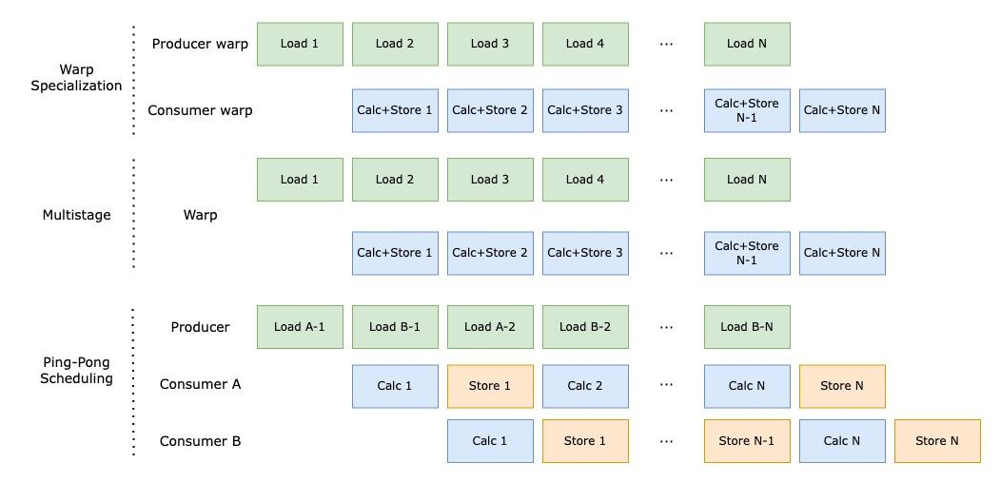
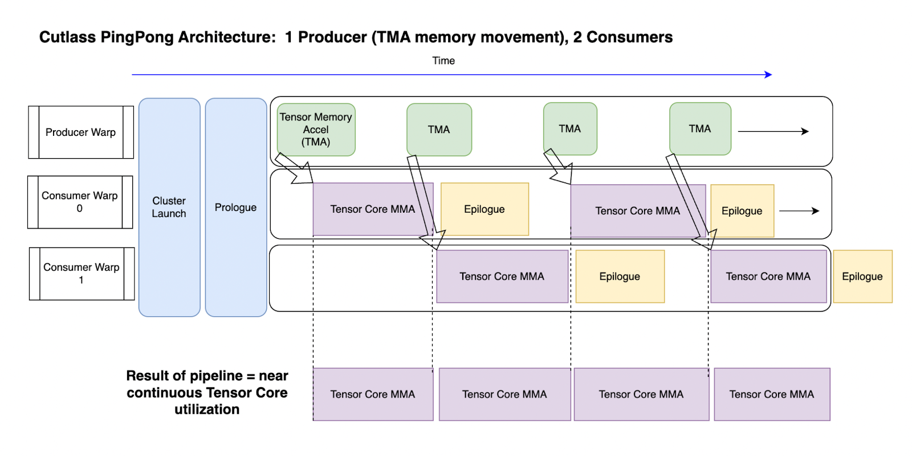

# 5090 版本flash attention实现
* 精度： bf16

相较于fa2新增如下feature
1. persistent 
2. warp-specialization（ping-pong）
3. TMA <br>
 <br>
 <br>


## Installation
### Base environment
+ `python>=3.13`   , `torch>=2.8.0`, `CUDA >=12.8`

### Install Package

```bash
cd blackwell
pip install -e . --no-build-isolation
```